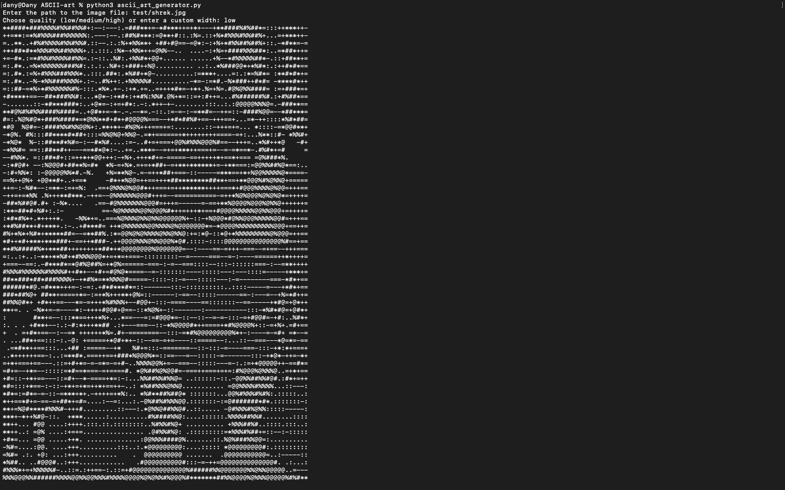

# ASCII Art Generator

This project converts images into ASCII art. It uses Python and the Pillow library to process images and map their pixels to ASCII characters.

[GitHub Release](https://github.com/DanyilT/Python/releases/tag/ascii_art-1.0.0)


## Features

- Convert any image to ASCII art.
- Supports different quality levels: low, medium, high, and custom width.
- Enhances image brightness, contrast, and sharpness for better ASCII representation.
- Saves the generated ASCII art to a text file.

## Requirements

- Python 3.x
- Pillow
- NumPy

### Installation

Just Google it, if you don't know how to install Python, Pillow or NumPy. Ask ChatGpt for any help.

> [!NOTE]
> To make script executable, on Linux and macOS, you need to add a shebang line at the top of the script. This line tells the operating system which interpreter to use to run the script. (or just run as `python3 ascii_art_generator.py`)
> 1. Update `ascii_art_generator.py` file to include the following lines at the top:
>   ```python
>   #!/usr/bin/env python3
>   ```
> 2. Make the script executable:
>   ```sh
>   chmod +x ascii_art_generator.py
>   ```
>   3. Run the script:
>   ```sh
>   ./ascii_art_generator.py
>   ```

> [!NOTE]
> How to create executable:
> 1. Install `pyinstaller`:
>   ```pip install pyinstaller``` or ```pip3 install pyinstaller```
> 2. Create executable:
>   ```sh
>   pyinstaller --onefile ascii_art_generator.py
>   ```

#### Windows

1. Download and install the latest version of Python from the [official Python website](https://www.python.org/downloads/windows/). Ensure that you check the box to add Python to your PATH during installation.
2. Install dependencies (Pillow and NumPy using pip):
    ```sh
    pip install -r requirements.txt
    ```

#### macOS

1. Download and install the latest version of Python from the [official Python website](https://www.python.org/downloads/macos/).
2. Install dependencies (Pillow and NumPy using pip):
    ```sh
    pip3 install -r requirements.txt
    ```

#### Linux

- If you are using a Linux, I think you already know what to do. You don't need my help.

## Usage

### Clone the Repository

#### Using Git

1. Clone the repository:
    ```sh
    git clone https://github.com/DanyilT/Python.git
    ```

2. Navigate to the project folder:
   - For Windows:
        ```sh
        cd Python\ASCII-art
        ```
   - For macOS and Linux:
        ```sh
        cd Python/ASCII-art
        ```

#### Downloading the ZIP File

1. Download the ZIP file from the [GitHub repository](https://github.com/DanyilT/Python.git) and extract it.
2. Navigate to the project folder in the extracted directory (`Python/ASCII-art`).

### Run the Script

- Run the script without any arguments to use the interactive mode:
   - For Windows:
        ```sh
        python ascii_art_generator.py
        ```
   - For macOS and Linux:
        ```sh
        python3 ascii_art_generator.py
        ```

- Run the script with arguments to specify the image path and quality level:
   - For Windows:
       ```sh
       python ascii_art_generator.py <image_path> <quality>
       ```
   - For macOS and Linux:
       ```sh
       python3 ascii_art_generator.py <image_path> <quality>
       ```

  1. `<image_path>`: Path to the input image file.
  2. `<quality>`: Quality level: `low`, `medium`, `high`, or a custom width (positive integer).

#### Saving the ASCII Art

After generating the ASCII art, the script will ask if you want to save it. The default filename is derived from the source image name, but you can provide a custom filename.

## File Structure

- `ascii_art_generator.py`: Main script to convert images to ASCII art.
- `test/`: Directory containing test images.
      - `shrek.jpg`: Sample image for testing the script.
      - `shrek.txt`: Sample output file containing the ASCII art of the sample image.
      - `output.txt`: Sample output file containing the ASCII art with custom quality (10000 symbols in a row).
- `README.md`: You are reading it right now.

### Functions in `ascii_art_generator.py`

- `main()`: Main function to parse arguments and generate ASCII art.
- `get_quality_width(quality)`: Determines the width based on the quality level.
- `image_to_ascii(image_path, width)`: Converts the image to ASCII art.
- `load_and_resize_image(image_path, width)`: Loads and resizes the image while maintaining the aspect ratio.
- `enhance_image(img)`: Enhances the image is good for ASCII representation.
- `image_to_grayscale(img)`: Converts the image to grayscale.
- `pixels_to_ascii(img)`: Maps the image pixels to ASCII characters.
- `save_ascii_art(ascii_art, output_file)`: Saves the ASCII art to a text file.
- `if __name__ == '__main__'`: Calls the `main()` function if the script is run directly.
